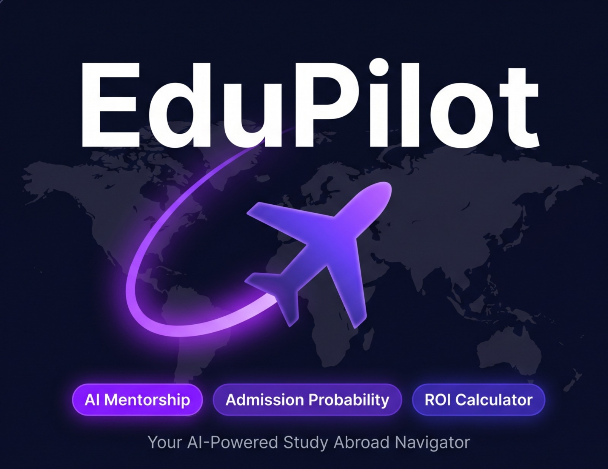
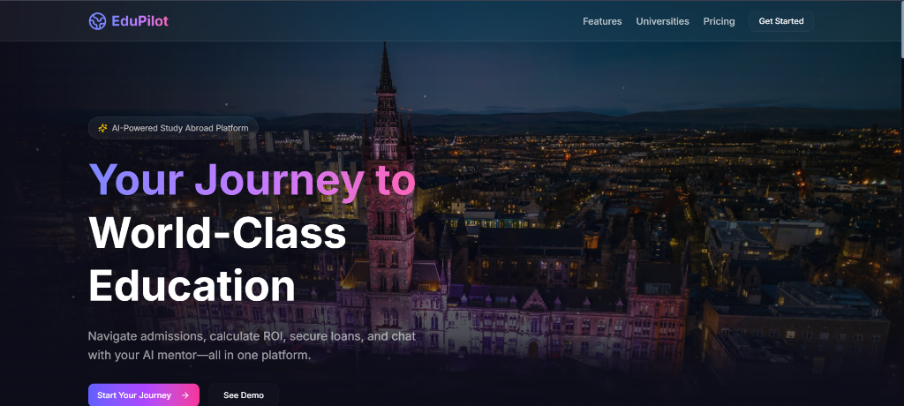
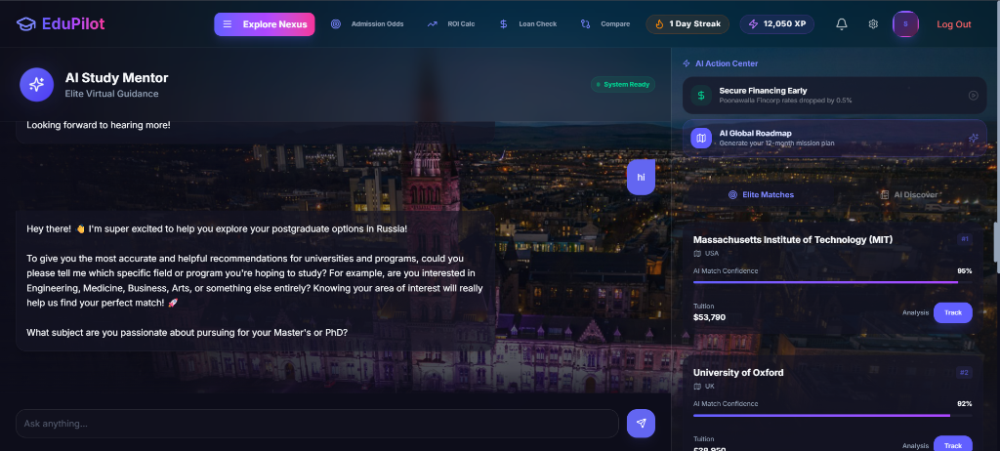
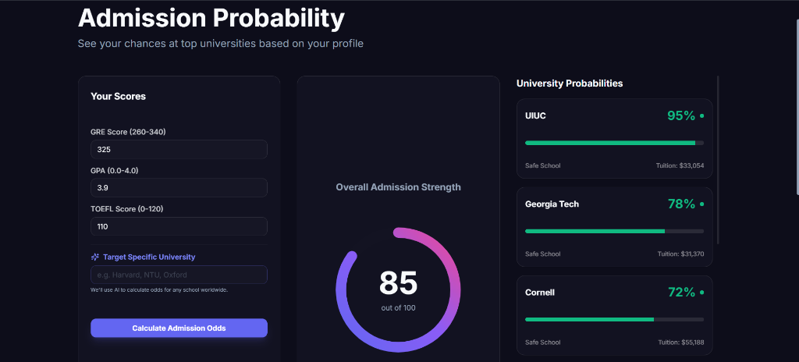
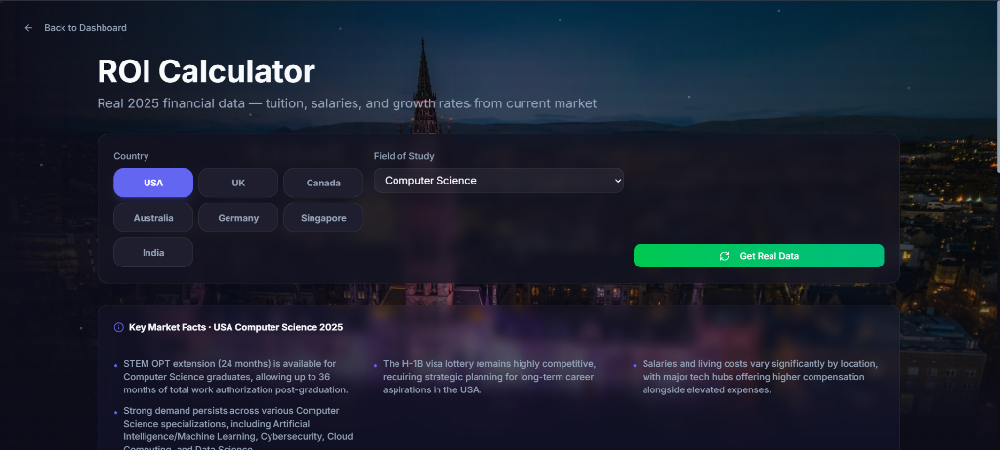
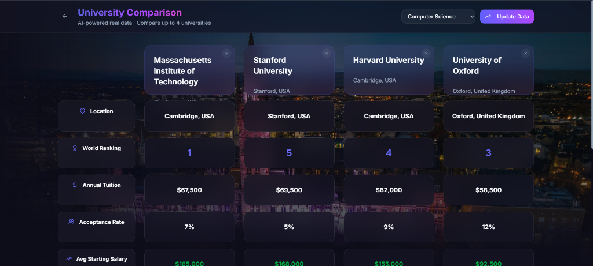
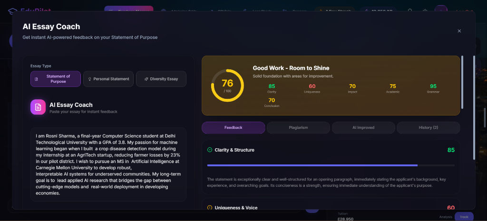

<div align="center">
  
</div>

# ✈️ EduPilot: Your AI-Powered Study Abroad Navigator

<div align="center">

[](https://edu-pilot-tau.vercel.app/)
[](https://www.youtube.com/watch?v=KlyZdECdCzA&t=1s)
[](https://github.com/swaraj3092/EduPilot)

</div>

<br>

## 🎯 The Problem: A Fragmented Journey Creates Anxiety

Over **1 million Indian students** plan to study abroad every year — yet nearly **40% drop off** before completing their application, lost to financial anxiety and information overload. The reason? The entire journey is broken across **5+ separate platforms** — university discovery, SOP writing, admission tracking, scholarship search, and loan applications all happen in complete silos.

Students are forced to manually transfer data between platforms and make life-changing financial decisions without real-time guidance. This fragmentation creates **"Financial Anxiety"** — the fear of committing to high-interest loans without certainty of admission or ROI. Students like **Rosni** (a 22-year-old final-year undergrad in early-stage application) need clarity on admission odds and clear ROI projections *before* they can confidently pursue financing.

| 📊 Stat | Impact |
|---|---|
| **1M+** | Indian students planning to study abroad annually |
| **40%** | Drop-off rate due to financial anxiety & information overload |
| **5+** | Separate platforms students must navigate alone |

<br>

## 💡 The Solution: EduPilot's Unified Ecosystem

**EduPilot** collapses the entire study-abroad journey into one intelligent, gamified platform — powered by **Gemini 2.5 Flash**. The platform creates a trust-building experience that moves students from AI engagement → data-driven certainty → confident financing decisions, all within a single intuitive interface.

| Stage | What EduPilot Does |
|---|---|
| 🔍 **Discovery** | AI-powered university & course matching based on your profile, budget, and goals |
| 📝 **Admission** | Data-driven admission odds with real-time radar charts + AI SOP coaching |
| 💰 **Financing** | Seamless loan eligibility check and scholarship matching at peak intent |

<br>

## 🖼️ Platform Screenshots

| 🏠 Landing Page | 🤖 AI Study Mentor |
|---|---|
|  |  |

| 🎯 Admission Probability | 📊 ROI Calculator |
|---|---|
|  |  |

| 🏛️ University Comparison | ✍️ AI Essay Coach |
|---|---|
|  |  |

> 🎬 *Watch the full demo: [youtube.com/watch?v=KlyZdECdCzA](https://www.youtube.com/watch?v=KlyZdECdCzA&t=1s)*

<br>

## 🚀 Key Features

### 🎮 Gamified Dashboard
- **Leveling System:** Progress from "Elite Navigator" to "Global Scholar" by completing missions
- **Quest Center:** Real-time tracking of research, application, and ROI milestones
- **Navigator Board:** Compete with other scholars on the global leaderboard

### 🤖 AI-Powered Mentorship
- **Live Radar Charts:** Real-time admission probability insights against top global universities
- **Streaming AI Mentor:** Conversational Gemini-powered career navigator — instant, personalized guidance 24/7
- **Essay Coach:** AI-driven SOP/Essay feedback with line-by-line suggestions and scoring
- **Smart University Search:** Find the perfect fit based on budget, field of study, and destination

### 📊 Financial Intelligence
- **Financial Time Machine:** 5–10 year ROI & salary projections by country and program
- **Seamless Loan Funnel:** Auto-triggered loan eligibility check at peak decision intent
- **Scholarship Finder:** Personalized scholarship recommendations matched to your profile

<br>

## 🧠 AI Architecture

EduPilot is built on a **three-engine AI stack** designed for accuracy, speed, and scale:

| Engine | Details |
|---|---|
| 🤖 **LLM Engine** | Gemini 2.5 Flash via FastAPI — real-time, context-aware responses across all modules |
| 📈 **ML Engine** | Custom ML logic for Admission Odds and ROI Projections using market-validated 2025 data |
| 🌐 **AI Agents** | SSE-streaming AI Career Navigators providing instant, personalized guidance across universities, visa, and career paths |

<br>

## 🛠️ Tech Stack

| Layer | Technology |
|---|---|
| **Frontend** | React 18 (Vite), Tailwind CSS, Framer Motion, Lucide React |
| **Backend** | FastAPI (Python), Uvicorn |
| **AI / LLM** | Google Gemini 2.5 Flash (Generative + Grounded Search) |
| **Database & Auth** | Supabase (PostgreSQL + Row-Level Security Authentication) |
| **Deployment** | Vercel (Frontend), Uvicorn (Backend) |

<br>

## 📦 Project Structure

```
EduPilot/
├── frontend/           # React (Vite) Application
├── edupilot-backend/   # FastAPI Python Backend
└── screenshots/        # Visuals of the platform
```

<br>

## ⚙️ Getting Started

### Prerequisites
- Node.js v18+
- Python 3.9+
- Supabase account
- Google AI Studio (Gemini) API Key

### 1. Backend Setup

```bash
cd edupilot-backend

# Create and activate virtual environment
python -m venv venv
source venv/bin/activate        # Windows: venv\Scripts\activate

# Install dependencies
pip install -r requirements.txt

# Run the server
uvicorn main:app --reload
```

> Create a `.env` file in `edupilot-backend/` with:
> ```
> GEMINI_API_KEY=your_key_here
> SUPABASE_URL=your_url_here
> SUPABASE_KEY=your_key_here
> ```

### 2. Frontend Setup

```bash
cd frontend

# Install dependencies
npm install

# Start dev server
npm run dev
```

<br>

## 🛡️ Responsible AI

EduPilot is built with AI transparency and responsible use at its core. We have proactively identified and addressed the following risks:

### ⚖️ Bias Awareness
Admission probability scores are derived from general academic patterns and publicly available acceptance data. They are **not a definitive prediction** and may not capture all institutional nuances (e.g., holistic review, regional preferences). We display confidence intervals alongside all probability scores to communicate uncertainty clearly.

### 🔍 Human Verification Required
All AI-generated suggestions — essay feedback, scholarship matches, ROI projections, and loan recommendations — are explicitly labeled as **"AI-assisted guidance"**. Users are encouraged to verify critical information with official university admissions offices and certified financial advisors.

### 🔒 Data Privacy & Security
- User data is stored securely via **Supabase with Row-Level Security (RLS)** — users can only access their own records.
- No personal academic or financial data is shared with third parties.
- Authentication tokens are stored in `localStorage` and never transmitted in cookies.
- API keys are environment-variable-protected and never exposed in client-side code.

### 🚫 No Over-Reliance
EduPilot is designed as a **decision-support tool**, not a replacement for professional education counselors. The platform surfaces information to empower students — the final decision always rests with the user.

### 🤖 AI Transparency
- All AI responses are clearly marked as generated by Gemini 2.5 Flash.
- The platform uses Gemini's **Grounded Search** mode with real-time retrieval to minimize hallucinations.
- Users can report incorrect AI outputs via in-app feedback.

<br>

## 👥 Team

**Swaraj Kumar Behera** — *Lead Full-Stack Architect*
- Engineered the entire EduPilot ecosystem from concept to production deployment.
- Built the core AI Agent dual-engine (Generative + Grounded Search).
- Designed the end-to-end gamification framework and real-time database synchronization.
- Oversaw full-stack integration across all academic and financial modules.


**Prajakta Kuila** — *UI/UX Design & Brand Identity*
- Crafted the premium glassmorphism aesthetic and interactive design system.
- Optimized the mobile AI Mentor experience for seamless on-the-go navigation.

<br>

## 📄 License

MIT License — feel free to build upon this project!
