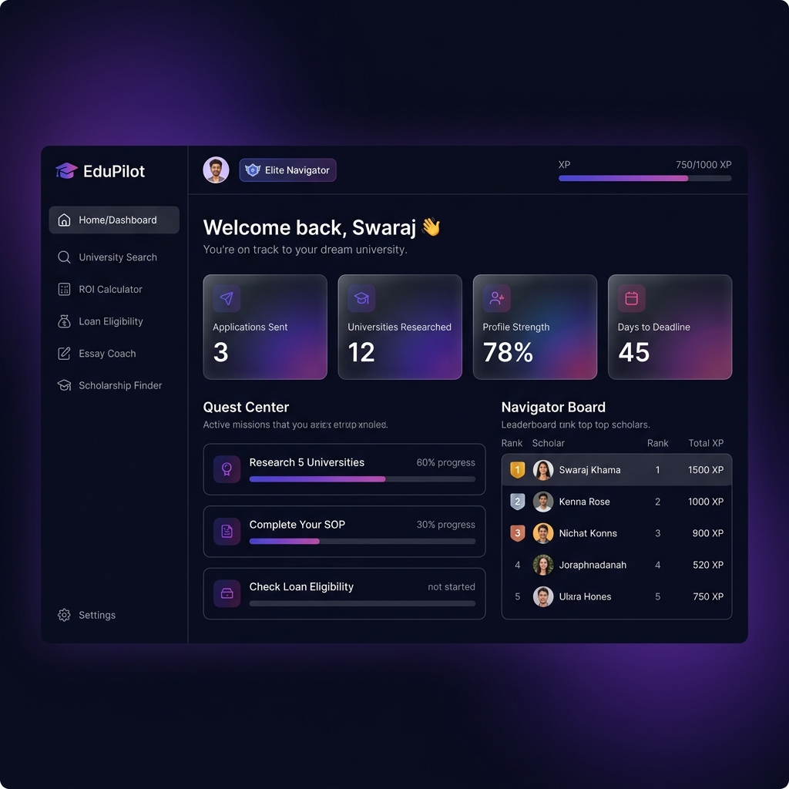

# ✈️ EduPilot: Your AI-Powered Study Abroad Navigator

[](https://edu-pilot-tau.vercel.app/)
[](https://github.com/swaraj3092/EduPilot)

Studying abroad is overwhelming — scattered information, no way to gauge real admission chances, zero financial clarity, and a long process with no motivation system. **EduPilot** solves all of that in one place.

It's a gamified, AI-driven platform that acts as your personal study-abroad mentor — from university discovery and AI-based admission probability to ROI calculation, scholarship matching, and SOP coaching.

<br>

## 🚀 Key Features

### 🎮 Gamified Dashboard
- **Leveling System:** Progress from "Elite Navigator" to "Global Scholar" by completing missions.
- **Quest Center:** Real-time tracking of research, application, and ROI milestones.
- **Navigator Board:** Compete with other scholars on the global leaderboard.

### 🤖 AI-Powered Mentorship
- **Admission Probability:** Instant profile analysis against top global universities with match scores.
- **Essay Coach:** AI-driven SOP/Essay feedback to strengthen your application.
- **AI Career Navigator:** Conversational Gemini-powered mentor for universities, visa, and career queries.
- **Smart University Search:** Find the perfect fit based on budget, field of study, and destination.

### 📊 Strategic Planning
- **ROI Calculator:** Compare the financial viability of different countries and programs.
- **Loan Eligibility:** Instant check for educational financing options.
- **Scholarship Finder:** Personalized scholarship recommendations based on your profile.

<br>

## 🖼️ Screenshots

| AI Career Navigator & University Match | Admission Probability Dashboard |
|---|---|
|  |  |

> *Live demo: [edu-pilot-tau.vercel.app](https://edu-pilot-tau.vercel.app/)*

<br>

## 🛠️ Tech Stack

| Layer | Technology |
|---|---|
| Frontend | React 18 (Vite), Tailwind CSS, Framer Motion, Lucide React |
| Backend | FastAPI (Python), Uvicorn |
| AI / LLM | Google Gemini AI API (Generative + Grounded Search) |
| Database & Auth | Supabase (PostgreSQL + Authentication) |
| Deployment | Vercel |

<br>

## 📦 Project Structure

```
EduPilot/
├── frontend/           # React (Vite) Application
├── edupilot-backend/   # FastAPI Python Backend
└── screenshots/        # Visuals of the platform
```

<br>

## ⚙️ Getting Started

### Prerequisites
- Node.js v18+
- Python 3.9+
- Supabase account
- Google AI Studio (Gemini) API Key

### 1. Backend Setup

```bash
cd edupilot-backend

# Create and activate virtual environment
python -m venv venv
source venv/bin/activate        # Windows: venv\Scripts\activate

# Install dependencies
pip install -r requirements.txt

# Run the server
uvicorn main:app --reload
```

> Create a `.env` file in `edupilot-backend/` with:
> ```
> GEMINI_API_KEY=your_key_here
> SUPABASE_URL=your_url_here
> SUPABASE_KEY=your_key_here
> ```

### 2. Frontend Setup

```bash
cd frontend

# Install dependencies
npm install

# Start dev server
npm run dev
```

<br>

## 👥 Team

**Swaraj Kumar Behera** — *Lead Full-Stack Architect*
- Engineered the entire EduPilot ecosystem from concept to production deployment.
- Built the core AI Agent dual-engine (Generative + Grounded Search).
- Designed the end-to-end gamification framework and real-time database synchronization.
- Oversaw full-stack integration across all academic and financial modules.

**Yagnish Anupam** — *Backend & Systems Integration*
- Designed the backend routing architecture and secure authentication handshakes.
- Optimized the university comparison engine for real-time high-fidelity data retrieval.

**Prajakta Kuila** — *UI/UX Design & Brand Identity*
- Crafted the premium glassmorphism aesthetic and interactive design system.
- Optimized the mobile AI Mentor experience for seamless on-the-go navigation.

<br>

## 📄 License

MIT License — feel free to build upon this project!
