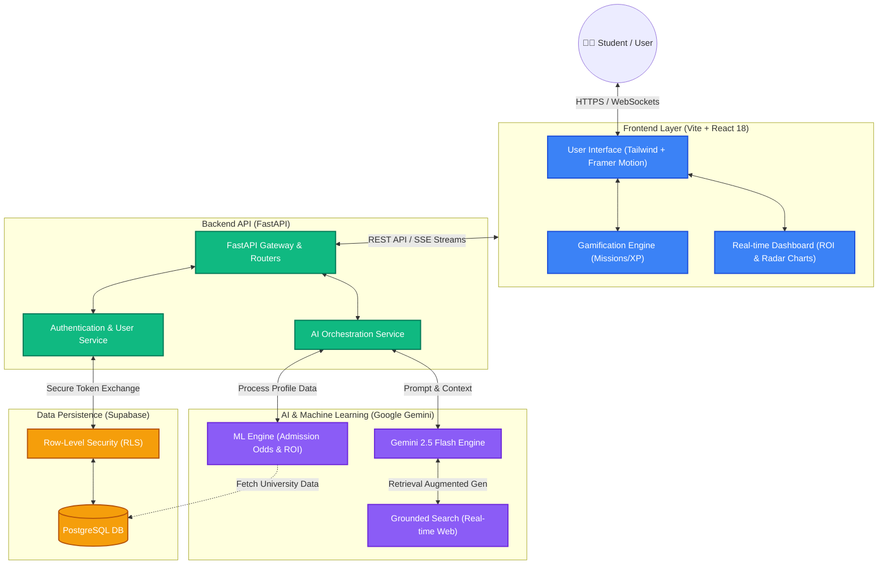

# EduPilot System Architecture

The following diagram illustrates the high-level architecture and data flow for the EduPilot platform. 

## Architecture Layers

### 1. Frontend Client
- **Tech Stack:** React 18, Vite, Tailwind CSS, Framer Motion.
- **Responsibility:** Handles user interactions, real-time visual feedback (radar charts, ROI graphs), and Server-Sent Events (SSE) for streaming AI chat responses.

### 2. Backend Server
- **Tech Stack:** FastAPI (Python), Uvicorn.
- **Responsibility:** Acts as the central gateway. It orchestrates user requests, connects to the database for state management, and acts as a secure proxy to the Gemini AI models.

### 3. AI & ML Engine
- **Tech Stack:** Google Gemini 2.5 Flash, Custom Python ML Logic.
- **Responsibility:** Generates personalized study-abroad guidance, analyzes Statement of Purpose (SOP) essays, and calculates data-driven admission probabilities.

### 4. Database & Auth
- **Tech Stack:** Supabase (PostgreSQL).
- **Responsibility:** securely stores user profiles, quest progress, and saved universities with strict Row-Level Security (RLS) ensuring data privacy.
